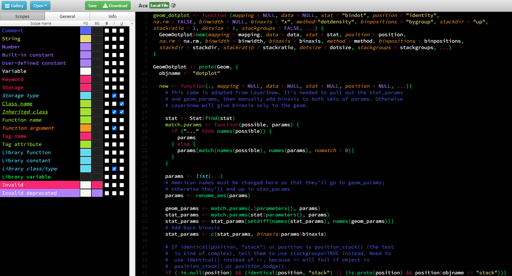
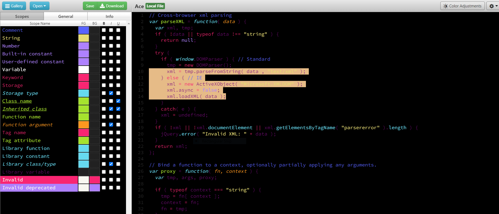

# rstudio-ace

Ace Theme is a theme for Rstudio based on Monokai. Background is completely black #000000 , and comments are made easier to see (blue), and the default text color is bright green. 

To load in Rstudio

```{r}
rstudioapi::addTheme("https://raw.githubusercontent.com/AnthonyEbert/rstudio-ace/main/Ace.tmTheme", apply = TRUE)
```



I made a new theme called Ace2, the differences from Ace are 

* highlighting is light orange and,
* default text color is purple

```{r}
rstudioapi::addTheme("https://raw.githubusercontent.com/AnthonyEbert/rstudio-ace/main/Ace2.tmTheme", apply = TRUE)
```

